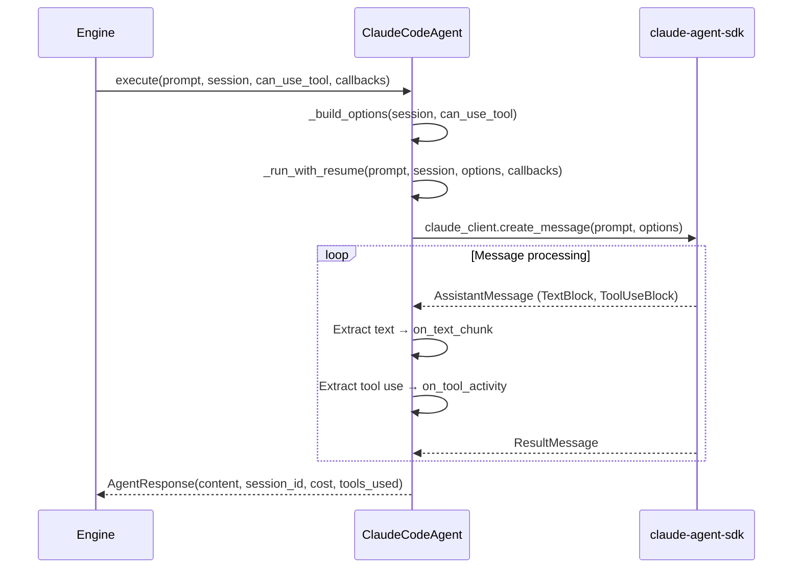
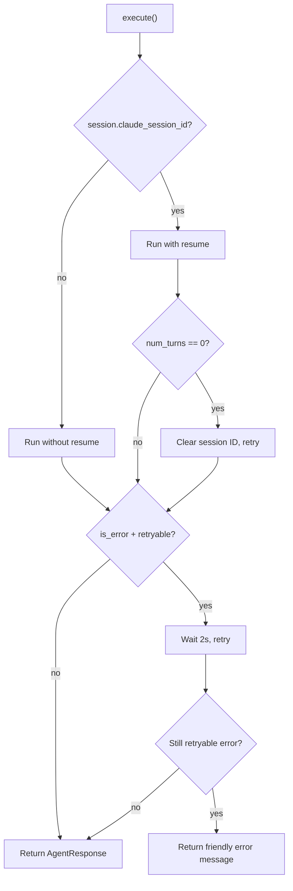

# Agent Protocol

Agents are the bridge between leashd and AI backends. The agent protocol is pluggable — swap the underlying model or SDK without changing the rest of the system.

## `BaseAgent` Protocol

```python
class BaseAgent(Protocol):
    async def execute(
        self,
        prompt: str,
        session: Session,
        *,
        can_use_tool: Callable[..., Any] | None = None,
        on_text_chunk: Callable[[str], Coroutine[Any, Any, None]] | None = None,
        on_tool_activity: Callable[
            [ToolActivity | None], Coroutine[Any, Any, None]
        ] | None = None,
    ) -> AgentResponse: ...

    async def cancel(self, session_id: str) -> None: ...

    async def shutdown(self) -> None: ...
```

| Method | Purpose |
|---|---|
| `execute()` | Run a prompt against the AI, returning a response. Accepts optional callbacks for tool gating, text streaming, and tool activity. |
| `cancel()` | Interrupt an active execution by session ID |
| `shutdown()` | Clean up all resources (connections, sessions) |

## Response Types

### `AgentResponse`

```python
class AgentResponse(BaseModel):
    model_config = ConfigDict(frozen=True)

    content: str
    session_id: str | None = None
    cost: float = 0.0
    duration_ms: int = 0
    num_turns: int = 0
    tools_used: list[str] = Field(default_factory=list)
    is_error: bool = False
```

### `ToolActivity`

```python
class ToolActivity(BaseModel):
    model_config = ConfigDict(frozen=True)

    tool_name: str
    description: str
```

Reported to the engine during execution so streaming can display which tool the agent is currently using.

## `ClaudeCodeAgent`

`ClaudeCodeAgent` (`agents/claude_code.py`) is the built-in implementation wrapping the `claude-agent-sdk`, which ships as the optional `leashd[claude-agent-sdk]` extra. The registry registers this runtime lazily and raises a `ConfigError` with install instructions when the package is absent, so every other runtime works without it.

### Execute Flow



### Option Building

`_build_options()` constructs `ClaudeAgentOptions` from config and session state:

| Option | Source |
|---|---|
| `cwd` | `session.working_directory` |
| `max_turns` | `config.effective_max_turns(session.mode)` — mode-specific limit (web: 300, test: 200, default: 250) |
| `system_prompt` | `config.system_prompt` + plan mode instruction (if `session.mode == "plan"`) |
| `allowed_tools` | `config.allowed_tools` |
| `disallowed_tools` | `config.disallowed_tools` |
| `resume` | `session.claude_session_id` (for multi-turn continuity) |
| `plugins` | `cc_plugins.get_enabled_plugin_paths()` — list of local plugin paths, refreshed every turn |
| `can_use_tool` | Tool gating callback from engine |

### Plan Mode Instruction

When `session.mode == "plan"`, a `_PLAN_MODE_INSTRUCTION` is appended to the system prompt. This tells the agent to explore and plan before implementing, and to call `ExitPlanMode` when the plan is ready.

### Session Resume with Stale Retry



If a resumed session returns zero turns, it means the session was stale. The agent clears the `claude_session_id` and retries once without resume. This handles cases where the SDK session has expired or been invalidated.

### Transient API Error Retry

When the Anthropic API returns a transient error, the SDK surfaces it as a `ResultMessage` with `is_error=True` and the raw error JSON in `result`. Instead of showing this to users, the agent automatically retries.

**Retryable errors** (matched by content):
- `500` — server error
- `529` — overloaded
- `api_error` — generic API error
- `overloaded` — capacity exceeded
- `rate_limit` — rate limit hit

**Retry behavior:**
- Up to 1 automatic retry with a 2-second backoff between attempts
- The retry loop allows up to 3 total attempts (original + stale session retry + API error retry)
- Non-retryable errors (e.g., `authentication_error`, `invalid_request_error`) are returned immediately

**User-facing message:** When all retries are exhausted and the error is still retryable, `execute()` replaces the raw API error with a friendly message: *"The AI service is temporarily unavailable. Please try again in a moment."* The response still carries `is_error=True` so callers can distinguish it from a success.

## `ClaudeCliAgent`

`ClaudeCliAgent` (`agents/runtimes/claude_cli.py`) wraps the Claude Code CLI binary directly via the NDJSON subprocess protocol. Unlike `ClaudeCodeAgent`, it has **no dependency on `claude-agent-sdk`** — only the `claude` CLI binary needs to be installed and authenticated.

### How It Works

The agent spawns `claude` with `--output-format stream-json --input-format stream-json --permission-prompt-tool stdio` and communicates via bidirectional NDJSON over stdin/stdout. It parses five message types: `control_response`, `stream_event`, `assistant`, `result`, and `system`. Tool permissions are handled via `control_request` messages with a `can_use_tool` callback — the same gatekeeper pipeline as the SDK agent.

### Capabilities

| Feature | Supported |
|---|---|
| Tool gating | Yes — same safety pipeline as `ClaudeCodeAgent` |
| Session resume | Yes — via NDJSON `session_id` fields |
| Streaming | Yes — real-time via `stream_event` messages |
| MCP servers | Yes — from `.mcp.json` and config |
| Attachments | Yes — images as base64, PDFs uploaded to `.leashd/uploads/` |
| Stability | Beta |

### When to Use

- **`tmux`** (default) — a real interactive `claude` TUI in a tmux pane; native slash commands and CLI dialogs bridge through to chat
- **`claude-cli`** — lighter dependency footprint, no SDK required, direct CLI protocol
- **`claude-code`** — if you need SDK-specific features or prefer the SDK's session management

### Shared Helpers

Both `ClaudeCliAgent` and `ClaudeCodeAgent` share common utilities extracted to `agents/runtimes/_helpers.py`: truncation, retry logic, backoff delays, content block building, workspace context formatting, MCP server discovery, and error mapping.

## Writing a Custom Agent

Implement the `BaseAgent` protocol:

```python
from leashd.agents.base import AgentResponse, BaseAgent, ToolActivity
from leashd.core.session import Session


class MyAgent:
    async def execute(
        self,
        prompt: str,
        session: Session,
        *,
        can_use_tool=None,
        on_text_chunk=None,
        on_tool_activity=None,
    ) -> AgentResponse:
        # Call your AI backend
        response_text = await my_llm_client.generate(prompt)
        return AgentResponse(content=response_text)

    async def cancel(self, session_id: str) -> None:
        pass

    async def shutdown(self) -> None:
        pass
```

Register the agent with the runtime registry in `agents/registry.py` via `register_agent()`, or pass it directly to `build_engine()`.

## Switching Runtimes

```bash
leashd runtime show              # current runtime
leashd runtime list              # available runtimes with stability
leashd runtime set tmux          # switch to tmux (default)
leashd runtime set claude-cli    # switch to claude-cli (native subprocess)
leashd runtime set claude-code   # switch to claude-code (SDK)
leashd runtime set codex         # switch to codex
```

The runtime is persisted in `~/.leashd/config.yaml`. The agent is created once at
daemon startup, so a restart (`leashd restart`) is required after switching.

## Restarting Without Losing Work

On the `tmux` runtime a daemon restart used to end every live agent: panes were
reaped at shutdown and swept again at startup. Since 1.6.0 they survive it.

A pane runs on a tmux server of its own, on leashd's private socket, so the pane
and the interactive `claude` in it never needed the daemon to stay alive. What
did was leashd's half of the binding — the hook secret, the pane-identity token
map, the Claude session uuid, the transcript read position and the safety
context a `PreToolUse` hook resolves to all lived in `TmuxSessionManager`'s
memory. Three pieces of state now cross the restart:

| State | Where it lives |
|---|---|
| Hook secret | `~/.leashd/tmux/hook-secret`, minted once (`LEASHD_TMUX_HOOK_SECRET` still overrides) |
| Per-pane identity, uuid, mode, transcript offset | `~/.leashd/tmux/<session_id>.pane.json` (`tmux_manifest.py`) |
| The conversation itself | The session row in SQLite, as before |

**Shutdown** (`TmuxSessionManager.shutdown_all(keep_panes=True)`) writes each
manifest while the session is still live, then releases only what leashd owns:
the awaited turn, the JSONL tailer, the dialog watcher, and any hook blocked on
an approval — the last is answered `deny` with an explicit "the daemon
restarted" reason so a pane cannot sit on its year-long hook timeout waiting for
a process that has exited.

**Startup** (`Engine.startup` → `TmuxSessionManager.adopt_orphan_panes`) walks
every `leashd_` session on the socket and adopts the ones it can still *gate*.
A pane is reaped exactly as before when it has no manifest, a dead pane, an age
past `LEASHD_TMUX_ADOPT_MAX_AGE_HOURS`, or hook settings that no longer reach
this daemon — `claude` reads `--settings` once at spawn, so a pane born under a
different port or an older secret can never call back, and adopting it would
look connected while nothing gated it.

An adopted pane that was mid-turn keeps its turn open, and the engine
re-attaches the chat's stream to it: the tailer resumes at the recorded byte
offset, so the records written while the daemon was down are replayed into the
chat and the answer lands as a normal reply. A transcript that was rotated or
compacted in the meantime falls back to the end of the file — losing the gap
beats replaying a whole conversation into the chat.

Adoption runs after `bind_safety` and before the hook receiver opens, so a
surviving pane's first hook is never seen as an unroutable orphan.

```bash
LEASHD_TMUX_PERSIST_PANES=false      # pre-1.6 behaviour: reap at stop and start
LEASHD_TMUX_ADOPT_MAX_AGE_HOURS=24   # 0 disables the age check
leashd stop --end-agents             # end the panes on this stop
```

Grep `tmux_pane_adopted`, `tmux_pane_not_adopted`, `tmux_panes_kept_for_restart`
and `tmux_jsonl_resumed_from_manifest` in `~/.leashd/logs/app.log` to see what a
restart reclaimed.
