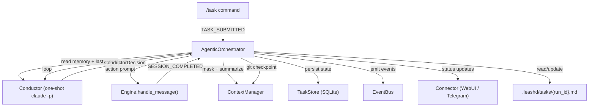
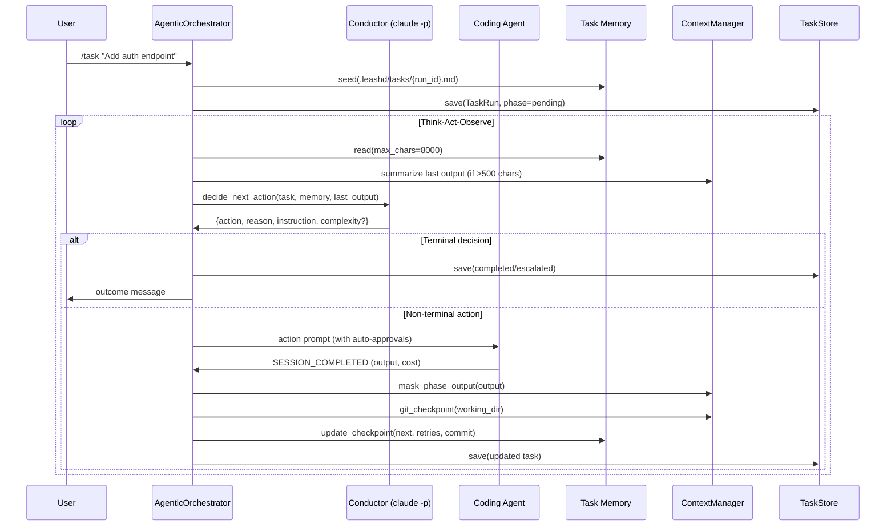
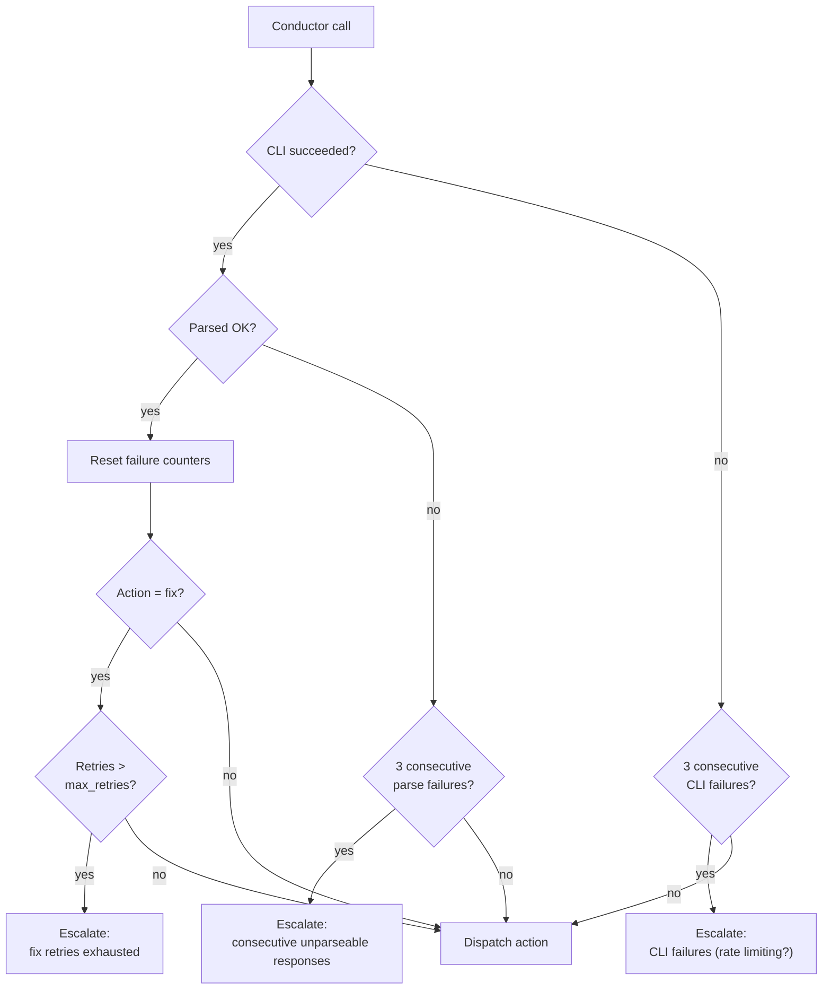
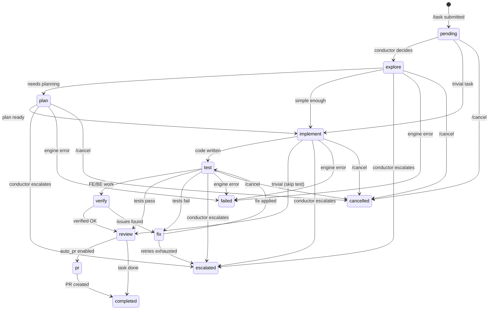

# Agentic Task Orchestrator (v2)

The v2 task orchestrator replaces the v1 fixed-pipeline approach with an LLM-driven **conductor loop**. Instead of a predetermined sequence (spec -> explore -> validate -> plan -> implement -> test -> pr), a one-shot `claude -p` call (the *conductor*) dynamically decides what the coding agent should do next based on three inputs: the task description, a persistent working memory file, and the output of the last action.

The result is adaptive behavior: trivial tasks skip straight to implementation, complex tasks get full exploration and planning, and failing tasks can retry or escalate without following a rigid pipeline. Each task gets a persistent `.leashd/tasks/{run_id}.md` memory file that survives daemon restarts and carries context across actions.

This document is standalone. For the v1 orchestrator, AutoApprover, AutoPlanReviewer, and AutonomousLoop, see [Autonomous Mode](autonomous-mode.md).

## Prerequisites

| Requirement | Details |
|---|---|
| Claude Code CLI | `claude` must be installed and authenticated (`claude /login`) |
| Task orchestrator enabled | `LEASHD_TASK_ORCHESTRATOR=true` |
| Orchestrator version | `LEASHD_TASK_ORCHESTRATOR_VERSION=v2` (default) |
| Connector | WebUI or Telegram — needed for status updates and escalation |
| Auto-approver (recommended) | `LEASHD_AUTO_APPROVER=true` for fully autonomous operation |
| Auto PR (optional) | `LEASHD_AUTO_PR=true` to create PRs automatically |

## Quick Start

```bash
leashd autonomous enable   # enables task orchestrator (v2), auto-approver, auto-plan reviewer
leashd start
```

From the WebUI or Telegram:

```
/task Add a health check endpoint to the FastAPI app
```

The conductor assesses complexity, then drives the agent through explore -> plan -> implement -> test -> review -> pr (or a shorter path for simpler tasks). You get a PR link — or an escalation message if the agent gets stuck.

## Architecture Overview



The `AgenticOrchestrator` is a plugin that subscribes to four events: `TASK_SUBMITTED`, `SESSION_COMPLETED`, `MESSAGE_IN` (for `/cancel`), and `CONFIG_RELOADED`. It coordinates all other components.

## The Conductor Loop (Think-Act-Observe)



### Think: Conductor Decision

The conductor is a one-shot `claude -p` CLI call in `_conductor.py`. It receives a context message containing the task description, the memory file content, and the last action output, then returns a JSON decision.

**System prompt:**

```
You are the orchestrator for an autonomous coding agent. You receive the task
description, the agent's working memory file, and the output of the last action.
Your job is to decide the SINGLE NEXT ACTION the coding agent should take.

Available actions:
- EXPLORE: Read codebase to understand architecture, conventions, and context.
- PLAN: Create a detailed implementation plan for complex changes.
- IMPLEMENT: Write code changes following the plan or task description.
- TEST: Run automated test suites (pytest, jest, vitest, etc.).
- VERIFY: Browser-based verification — start dev server, navigate to pages/endpoints,
  confirm UI renders correctly or API responds as expected.
- FIX: Fix specific issues found in testing or verification.
- REVIEW: Self-review all changes via git diff. Read-only — no modifications.
- PR: Create a pull request (branch, commit, push, gh pr create).
- COMPLETE: Task is fully done and verified.
- ESCALATE: Human intervention needed — stuck, ambiguous, or beyond agent capability.

Complexity levels (assess on first call only):
- TRIVIAL: Single-line fix, simple query, config tweak
- SIMPLE: Small bug fix, config change, minor feature (<50 lines)
- MODERATE: Multi-file change, new feature, requires architecture understanding
- COMPLEX: Major refactor, new subsystem, cross-cutting concerns
- CRITICAL: Security fix, data migration, breaking change

Typical flows (guidelines, not rules):
- TRIVIAL: implement -> complete
- SIMPLE: explore -> implement -> test -> complete
- MODERATE: explore -> plan -> implement -> test -> verify -> review -> complete
- COMPLEX: explore -> plan -> implement -> test -> verify -> fix -> review -> pr -> complete

Rules:
- Always REVIEW before COMPLETE on non-trivial tasks
- If tests/verification failed 3+ times for the same reason -> ESCALATE
- If the memory file shows prior work, continue from the checkpoint — don't restart
- Skip EXPLORE if the task is self-contained and trivial
- Skip PLAN if the task is simple enough to implement directly
- For FE/BE work: use VERIFY after TEST
- VERIFY is strongly recommended for tasks involving web endpoints, UI components, or API changes
- When uncertain whether to retry or escalate, check the retry count

Respond with EXACTLY one JSON object (no markdown fences, no extra text):
{"action": "<ACTION>", "reason": "<one-line why>", "instruction": "<specific guidance>"}

On the FIRST call (when complexity has not been assessed yet), also include:
{"action": "...", "reason": "...", "instruction": "...", "complexity": "<LEVEL>"}
```

**Context building:** The conductor receives a structured message with `TASK:`, `CURRENT PHASE:`, `RETRIES: N of M`, `MEMORY FILE:` (sanitized, wrapped in `<<<...>>>`), and `LAST ACTION OUTPUT:` (truncated to 4000 chars). On the first call, a special addendum instructs it to assess complexity.

**Response parsing:** Tries three strategies in priority order:
1. JSON extraction via regex — looks for `{...}` with a valid action
2. Fallback line format — matches `ACTION: reason` (case-insensitive)
3. Default — returns `implement` with a warning (fail-forward)

**CLI failure fallback:** If the `claude -p` call times out or crashes, returns `explore` on first call, `implement` otherwise. Never raises.

### Act: Action Dispatch

The orchestrator maps the conductor's chosen action to a session mode, builds an action-specific prompt, configures auto-approvals, and calls `engine.handle_message()`.

**Action-to-session-mode mapping:**

| Action | Session Mode |
|---|---|
| `explore` | `auto` |
| `plan` | `plan` |
| `implement` | `auto` |
| `test` | `test` |
| `verify` | `test` |
| `fix` | `auto` |
| `review` | `plan` |
| `pr` | `auto` |

**Prompt structure:**

```
AUTONOMOUS TASK — Action: {action}
TASK: {task_description}
WORKING DIRECTORY: {working_directory}

INSTRUCTION: {conductor_instruction}

TASK MEMORY (.leashd/tasks/{run_id}.md):
```
{memory_content}
```

IMPORTANT: Update the task memory file with your findings and progress.

{action-specific suffix}

GIT CHECKPOINTS (auto-committed after each phase):
  - explore: abc123
  - implement: def456
```

### Observe: Output Capture

When the agent completes an action (`SESSION_COMPLETED` event):

1. **Mask output** — `mask_phase_output()` truncates to 1500 chars (40% head + 60% tail)
2. **Track cost** — Accumulates per-action and total cost from the session
3. **Git checkpoint** — Auto-commits all changes with `leashd-checkpoint: {phase} [run_id={id}]`
4. **Update memory checkpoint** — Writes orchestrator state back to the memory file's `## Checkpoint` section
5. **Save to SQLite** — Persists the updated TaskRun
6. **Summarize for conductor** — If output > 500 chars, compress via a `claude -p` call before feeding to the next conductor decision

Then the loop restarts with the next conductor call.

## Actions Reference

| Action | Mode | Auto-Approvals | What It Does |
|---|---|---|---|
| **explore** | `auto` | Read-only bash (`cat`, `ls`, `grep`, `find`, `head`, `tail`, `wc`) | Read codebase to understand architecture, conventions, relevant files. Writes findings to `## Codebase Context`. |
| **plan** | `plan` | — | Read CLAUDE.md, create detailed implementation plan (files to modify, key changes, test strategy). Writes to `## Plan`. |
| **implement** | `auto` | Write, Edit, NotebookEdit, implementation bash (pytest, npm, ruff, mypy, cargo, etc.) | Write code changes. **Mandatory**: run lint, type check, and unit tests. Fix all failures before completing. |
| **test** | `test` | Write, Edit, browser tools, test bash (playwright, jest, vitest, pytest, curl, etc.) | Run automated test suites. Write results to `## Test Results`. |
| **verify** | `test` | Write, Edit, browser tools (Playwright MCP or agent-browser), test bash | Browser-based verification: start dev server, navigate, snapshot, check console, screenshot. Write to `## Verification`. |
| **fix** | `auto` | Write, Edit, NotebookEdit, implementation bash | Fix specific issues from testing/verification. No unrelated refactoring. |
| **review** | `plan` | Read-only bash | Self-review via `git diff`. Check patterns, conventions, edge cases, security, cleanliness. **No modifications.** Write to `## Review Notes`. |
| **pr** | `auto` | Write, Edit, git, gh, implementation bash | Create branch, commit, push, open PR via `gh pr create`. |
| **complete** | — | — | Terminal: task is done. Emits `TASK_COMPLETED`. |
| **escalate** | — | — | Terminal: human intervention needed. Emits `TASK_ESCALATED`. |

## Complexity Assessment

The conductor assesses complexity on the **first call only**. The complexity is stored in `TaskRun.complexity` and included in completion messages.

| Level | Description | Typical Flow |
|---|---|---|
| **trivial** | Single-line fix, config tweak, simple query | implement -> complete |
| **simple** | Small bug fix, minor feature (<50 lines) | explore -> implement -> test -> complete |
| **moderate** | Multi-file change, new feature, requires architecture understanding | explore -> plan -> implement -> test -> verify -> review -> complete |
| **complex** | Major refactor, new subsystem, cross-cutting concerns | explore -> plan -> implement -> test -> verify -> fix -> review -> pr -> complete |
| **critical** | Security fix, data migration, breaking change | Same as complex, with extra caution |

These are guidelines for the conductor, not enforced constraints. The conductor can deviate based on context — for example, skipping `verify` if the task has no UI component, or going straight to `implement` if it already understands the codebase.

## Task Memory System

Each task gets a persistent markdown file at `.leashd/tasks/{run_id}.md` in the project working directory. The coding agent writes progress into this file; the orchestrator reads it back to build context for the conductor.

### Memory File Format

```markdown
# Task: Add a health check endpoint to the FastAPI...
Run ID: a1b2c3d4e5f6g7h8 | Status: in-progress | Complexity: pending
Created: 2026-03-30T12:00:00Z | Updated: 2026-03-30T12:00:00Z

## Task Description
Add a health check endpoint to the FastAPI app

## Assessment
(pending — the orchestrator will assess complexity on the first action)

## Codebase Context
(not yet explored)

## Plan
(no plan yet)

## Progress
| # | Action | Result | Time |
|---|--------|--------|------|

## Changes
(no changes yet)

## Test Results
(not yet tested)

## Verification
(not yet verified)

## Review Notes
(not yet reviewed)

## Checkpoint
Next: pending | Retries: 0 | Blocked: none
```

### Smart Truncation

When the memory file exceeds `max_chars` (default 8000, configurable via `LEASHD_TASK_MEMORY_MAX_CHARS`):

- **60% head** — preserves Task Description, Assessment, Codebase Context, and Plan (the immutable context the conductor needs)
- **40% tail** — preserves recent Progress entries and the Checkpoint section (the latest state)
- Tries to split at the `## Progress` boundary so plan sections stay intact in the head
- Falls back to newline-boundary splitting if `## Progress` is too deep
- Inserts `[...middle truncated...]` marker between head and tail

### Checkpoint Section

```
## Checkpoint
Next: test | Retries: 2 | Blocked: none | Commit: a1b2c3d
```

| Field | Purpose |
|---|---|
| `Next` | Next expected action (used for fast-path restart recovery) |
| `Retries` | Current retry count |
| `Blocked` | Blocking reason if any (`none` otherwise) |
| `Commit` | Short git hash of the last checkpoint commit |

The orchestrator writes the checkpoint after each action via `update_checkpoint()` — this ensures it reflects true system state even if the coding agent didn't update it.

## Context Management

Three strategies from `context_manager.py` keep the conductor's context window focused:

### Observation Masking

Truncates verbose outputs while preserving both the command context (head) and final results/errors (tail).

| Category | Max Chars | Head/Tail Split |
|---|---|---|
| Tool output | 800 | 40% head / 60% tail |
| Phase output | 1500 | 40% head / 60% tail |
| Error output | 2000 | 40% head / 60% tail |

The tail bias (60%) ensures error messages — which tend to appear at the end — are preserved. Splits snap to newline boundaries for readability.

### Phase Summarization

When a completed action's output exceeds 500 chars, the orchestrator compresses it via a one-shot `claude -p` call before feeding it to the conductor.

**System prompt:**
```
You are summarizing the output of a completed phase in an autonomous coding task.
Write a concise summary (3-8 lines) capturing:
- What was accomplished
- Key decisions or findings
- Any issues or failures encountered
- File paths or function names that were changed/discovered

Be specific and factual. No filler. Output ONLY the summary, no preamble.
```

Falls back to masked output on CLI failure — never raises. Summaries are cached in `phase_context` (e.g., `explore_summary`) to avoid re-summarization on restart.

### Git-Backed Checkpointing

After each action completion, `git_checkpoint()` stages all changes and commits:

```
leashd-checkpoint: implement [run_id=a1b2c3d4e5f6g7h8]

Phase completed: implement
Task run: a1b2c3d4e5f6g7h8
```

- Uses `--no-verify` to skip hooks for checkpoint commits
- Returns the short commit hash, stored in `phase_context["{action}_checkpoint"]`
- Checkpoint hashes are included in subsequent action prompts so the agent sees what commits exist
- No-op if nothing to commit or not in a git repo
- Enables `git log --grep "leashd-checkpoint"` to filter task commits

## Circuit Breakers and Error Handling



| Failure | Detection | Threshold | Result |
|---|---|---|---|
| Conductor parse failure | `"unparseable"` in reason | 3 consecutive | Escalate to human |
| Conductor CLI failure | `"conductor call failed"` in reason | 3 consecutive | Escalate with rate-limiting warning |
| Fix retries exhausted | `retry_count > max_retries` | Default: 3 | Escalate to human |
| Engine runtime error | Exception in `handle_message()` | 1 | Task marked `failed` (outcome=`error`) |
| Stale task | No `last_updated` for 24+ hours | On daemon start | Task marked `failed` (outcome=`timeout`) |
| User cancellation | `/cancel`, `/stop`, or `/clear` | Immediate | Task marked `cancelled` |

Both parse and CLI failure counters **reset to zero** on any successful conductor call. This prevents a single transient error from accumulating toward escalation across unrelated actions.

## State Machine



Unlike v1's fixed pipeline, **any non-terminal action can transition to any other action** — the conductor decides dynamically. The diagram above shows the most common flows, but the conductor is not constrained to these paths.

**Terminal phases:**

| Phase | Outcome | Trigger |
|---|---|---|
| `completed` | `ok` | Conductor returns `complete` |
| `escalated` | `escalated` | Conductor returns `escalate`, circuit breaker trips, or fix retries exhausted |
| `failed` | `error` or `timeout` | Engine exception or stale task cleanup (24h) |
| `cancelled` | `cancelled` | User sends `/cancel`, `/stop`, or `/clear` |

## Restart Recovery

On daemon start, the orchestrator loads all non-terminal tasks from SQLite and resumes them.

### Recovery Flow

1. **Cleanup** — Mark tasks not updated for 24+ hours as `failed` (outcome=`timeout`)
2. **Load** — `TaskStore.load_all_active()` fetches all non-terminal tasks
3. **Resume** — For each active task, call `_resume_task()`

### Fast Path vs. Conductor Path

- **Fast path** — If the memory file has a valid `## Checkpoint` section with a `next` field that maps to a known action (`_ACTION_TO_MODE`), skip the conductor call and resume directly from that action. Avoids an API call for straightforward resumes.
- **Conductor path** — If the memory file exists but has no valid checkpoint, call the conductor with `"(resumed after daemon restart)"` as the last output. The conductor reassesses the situation from the memory file.
- **Notification** — Sends a connector message: "Daemon restarted. Resuming task from: {phase}". Emits `TASK_RESUMED` event.

## Configuration Reference

| Variable | Type | Default | Description |
|---|---|---|---|
| `LEASHD_TASK_ORCHESTRATOR` | `bool` | `false` | Enable the task orchestrator |
| `LEASHD_TASK_ORCHESTRATOR_VERSION` | `"v1"` \| `"v2"` | `v2` | Orchestrator version — `v2` uses the conductor loop |
| `LEASHD_TASK_MAX_RETRIES` | `int` | `3` | Max fix retries before escalation |
| `LEASHD_TASK_PHASE_TIMEOUT_SECONDS` | `int` | `1800` | Max seconds per phase (30 minutes) |
| `LEASHD_TASK_CONDUCTOR_MODEL` | `str` \| `None` | `None` | Model override for conductor calls (passed as `--model` to CLI) |
| `LEASHD_TASK_CONDUCTOR_TIMEOUT` | `float` | `45.0` | Timeout in seconds for conductor CLI calls |
| `LEASHD_TASK_MEMORY_MAX_CHARS` | `int` | `8000` | Max chars for memory file reads (smart truncation) |
| `LEASHD_AUTO_PR` | `bool` | `false` | Auto-create PR when conductor chooses `pr` action |
| `LEASHD_AUTO_PR_BASE_BRANCH` | `str` | `main` | Target branch for auto-created PRs |

See [Configuration](configuration.md) for the full environment variable reference.

## Commands

| Command | Effect |
|---|---|
| `/task <description>` | Submit a new task. Seeds a memory file, creates a TaskRun, starts the conductor loop. One active task per chat. |
| `/cancel` | Cancel the active task immediately. Also triggered by `/stop` and `/clear`. |
| `/tasks` | List tasks for the current chat — active first, then recent completed/failed. |

## Events

| Event | Constant | When | Payload Keys |
|---|---|---|---|
| `task.submitted` | `TASK_SUBMITTED` | `/task` command received | `user_id`, `chat_id`, `session_id`, `task`, `working_directory` |
| `task.phase_changed` | `TASK_PHASE_CHANGED` | Conductor selects a new action | `run_id`, `chat_id`, `phase`, `previous_phase` |
| `task.completed` | `TASK_COMPLETED` | Conductor returns `complete` | `run_id`, `chat_id`, `total_cost`, `complexity`, `retry_count` |
| `task.failed` | `TASK_FAILED` | Engine error or stale timeout | `run_id`, `chat_id`, `total_cost`, `complexity`, `retry_count`, `error` |
| `task.escalated` | `TASK_ESCALATED` | Circuit breaker or retries exhausted | `run_id`, `chat_id`, `total_cost`, `complexity`, `retry_count`, `error` |
| `task.cancelled` | `TASK_CANCELLED` | User cancelled | `run_id`, `chat_id`, `total_cost`, `complexity`, `retry_count` |
| `task.resumed` | `TASK_RESUMED` | Daemon restart recovery | `run_id`, `chat_id`, `phase` |

See [Events](events.md) for the full event reference.

## Data Model

### TaskRun

| Field | Type | Description |
|---|---|---|
| `run_id` | `str` | 16-char hex UUID |
| `user_id` | `str` | User who submitted the task |
| `chat_id` | `str` | Chat where the task is running |
| `session_id` | `str` | Agent session ID |
| `task` | `str` | Full task description |
| `phase` | `TaskPhase` | Current action (or terminal state) |
| `previous_phase` | `TaskPhase?` | Action before the current one |
| `outcome` | `TaskOutcome?` | `ok`, `error`, `timeout`, `cancelled`, `escalated` |
| `error_message` | `str?` | Error details on failure/escalation |
| `retry_count` | `int` | Fix retry counter |
| `max_retries` | `int` | Max retries before escalation (default 3) |
| `phase_context` | `dict` | Accumulated action outputs, summaries, checkpoints, counters |
| `total_cost` | `float` | Total API cost across all actions |
| `phase_costs` | `dict` | Per-action cost breakdown |
| `complexity` | `str?` | Conductor's complexity assessment |
| `memory_file_path` | `str?` | Path to `.leashd/tasks/{run_id}.md` |

### SQLite Schema

```sql
CREATE TABLE IF NOT EXISTS task_runs (
    run_id TEXT PRIMARY KEY,
    user_id TEXT NOT NULL,
    chat_id TEXT NOT NULL,
    session_id TEXT NOT NULL,
    parent_run_id TEXT,
    task TEXT NOT NULL,
    phase TEXT NOT NULL DEFAULT 'pending',
    previous_phase TEXT,
    outcome TEXT,
    error_message TEXT,
    retry_count INTEGER DEFAULT 0,
    max_retries INTEGER DEFAULT 3,
    phase_context TEXT DEFAULT '{}',
    created_at TEXT NOT NULL,
    started_at TEXT,
    phase_started_at TEXT,
    completed_at TEXT,
    last_updated TEXT NOT NULL,
    total_cost REAL DEFAULT 0.0,
    phase_costs TEXT DEFAULT '{}',
    working_directory TEXT NOT NULL,
    phase_pipeline TEXT DEFAULT '[]',
    complexity TEXT,
    memory_file_path TEXT
);

CREATE INDEX IF NOT EXISTS idx_task_runs_chat ON task_runs (chat_id, phase);
CREATE INDEX IF NOT EXISTS idx_task_runs_user ON task_runs (user_id, created_at DESC);
```

### Per-Chat Serialization

`KeyedAsyncQueue` (`core/queue.py`) ensures tasks for the same chat execute sequentially (FIFO), while different chats run concurrently. This prevents race conditions when multiple `SESSION_COMPLETED` events arrive for the same chat. The queue auto-prunes at 100+ keys.

## v1 vs v2 Comparison

| Aspect | v1 (TaskOrchestrator) | v2 (AgenticOrchestrator) |
|---|---|---|
| **Pipeline** | Fixed 9-step (spec -> explore -> validate_spec -> plan -> validate_plan -> implement -> test -> retry -> pr) | Dynamic — conductor chooses from 10 actions |
| **Decision engine** | Hardcoded phase transitions + keyword heuristics | LLM conductor (one-shot `claude -p`) |
| **Complexity assessment** | None | 5 levels assessed on first call |
| **Working memory** | Phase context accumulation in prompt (last 2000 chars/phase) | Persistent `.md` file in `.leashd/tasks/` (8K smart truncation) |
| **Context management** | None | Observation masking + phase summarization |
| **Git checkpointing** | None | Auto-commit after each action |
| **Restart recovery** | Re-execute current phase from scratch | Memory file checkpoint fast-path |
| **Browser verification** | None | Dedicated `verify` action with Playwright or agent-browser |
| **Self-review** | None | Dedicated `review` action via `git diff` |
| **Config variable** | `LEASHD_TASK_ORCHESTRATOR_VERSION=v1` | `LEASHD_TASK_ORCHESTRATOR_VERSION=v2` (default) |

See [Autonomous Mode — Task Orchestrator](autonomous-mode.md#task-orchestrator) for the v1 reference.

## Safety Guarantees

1. **All tool calls pass through the full safety pipeline.** The orchestrator configures per-action auto-approvals, but cannot bypass sandbox or deny rules. Credentials, force push, `rm -rf`, sudo, etc. are always denied regardless of what the conductor instructs.

2. **Auto-approvals are action-scoped.** Explore/review get read-only tools only. Implement/fix get write + lint/test tools. Test/verify get browser tools. PR gets git/gh tools. Auto-approvals are cleared between actions and on terminal states.

3. **Circuit breakers prevent infinite loops.** 3 consecutive conductor parse failures, 3 consecutive CLI failures, and max_retries fix attempts all escalate to the human.

4. **Prompt injection defense.** Conductor inputs are sanitized via `sanitize_for_prompt()` — strips bidi marks, zero-width chars, and C0/C1 control characters. Memory content and outputs are wrapped in `<<<...>>>` delimiters.

5. **User can always intervene.** `/cancel`, `/stop`, or `/clear` immediately cancels the active task, cancels the running agent session, and transitions to `cancelled`.

6. **Fail-forward conductor.** The conductor never raises exceptions — on failure it returns a safe fallback action. This ensures a transient API error doesn't crash the task.

See [Safety Pipeline](safety-pipeline.md) for the full sandbox/policy/approval pipeline.

## File Reference

| File | Role |
|---|---|
| `leashd/plugins/builtin/agentic_orchestrator.py` | Main plugin: AgenticOrchestrator class, action dispatch, auto-approvals |
| `leashd/plugins/builtin/_conductor.py` | Conductor: LLM-driven decision engine, system prompt, response parsing |
| `leashd/core/task.py` | TaskRun model, TaskPhase enum, TaskStore (SQLite CRUD) |
| `leashd/core/task_memory.py` | Persistent markdown memory: seed, read, checkpoint parse/update |
| `leashd/core/context_manager.py` | Observation masking, phase summarization, git checkpointing |
| `leashd/core/queue.py` | KeyedAsyncQueue for per-chat serialization |
| `leashd/plugins/builtin/_cli_evaluator.py` | Shared CLI utilities: `evaluate_via_cli`, `sanitize_for_prompt` |
